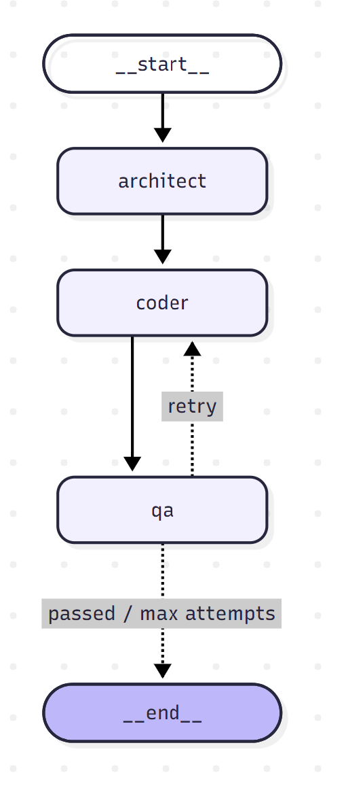

# refactor-agent

A multi-agent system that takes a legacy Python module, refactors it, writes its own tests, runs them in a sandboxed Docker container, and fixes its own bugs until the tests pass.



## How it works

Three agents share one typed state, and LangGraph orchestrates them as a state machine.

| Agent | Uses an LLM? | Job |
|---|---|---|
| **Architect** | Yes | Analyzes the legacy module and writes a refactoring plan: code smells, target design, behaviors to preserve, and a test plan |
| **Coder** | Yes | Implements the plan as `refactored.py` + `test_refactored.py`. On retries, it sees its previous attempt and the full failure history |
| **QA** | No | Runs the tests in an isolated Docker container and records pass/fail. Each failure is appended to the error history |

After QA, a conditional edge routes the run:
- **passed** → done
- **failed** → back to the Coder
- **3 attempts used** → stop

## Key design decisions

- **Plan before code.** The Architect separates *what* to change from *how*. The plan is a reviewable artifact, and it gives the Coder a fixed spec to return to on every retry.
- **Behavior preservation.** The plan must list every observable behavior of the original, including its quirks. Behavior changes are allowed only if they're declared and justified.
- **Error memory via an append reducer.** `error_history` is annotated with `operator.add`, so failures accumulate across retries and the Coder can see which fixes already failed.
- **Sandboxed execution.** LLM-generated code is untrusted. Tests run in a fresh container with these limits:
  - a read-only mount
  - no network
  - a 256 MB memory cap
  - a 60 s timeout

  The container is destroyed after every run.
- **Deterministic QA.** Pass/fail comes from pytest's exit code, not from an LLM. LLMs are used for judgment, and plain code is used for facts.
- **Guarding against reward hacking.** The Coder is explicitly told never to weaken or delete a test to make it pass.
- **Bounded retries.** A 3-attempt cap limits both runtime and API cost.

## Setup

Requirements: Python 3.12+, Docker Desktop, and an Anthropic API key.

```bash
git clone https://github.com/rainalahiri/refactor-agent.git
cd refactor-agent
python -m venv .venv
.venv\Scripts\Activate.ps1        # Windows
# source .venv/bin/activate       # macOS / Linux
pip install -r requirements.txt
docker build -t refactor-sandbox docker
```

Create a `.env` file in the project root:

```
ANTHROPIC_API_KEY=your-key-here
```

## Usage

Refactor the included sample:

```bash
python main.py
```

Refactor any single-file Python module:

```bash
python main.py path/to/module.py
```

Demo the self-correction loop. This sabotages the first attempt on purpose:

```bash
python main.py --inject-bug
```

Example output:

```
[architect] done
[demo] injecting bug: '<= 0' -> '< 0'
[coder] done
[qa] attempt 1: FAILED
     FAILED test_refactored.py::test_remove_exact_deletes - AssertionError
     FAILED test_refactored.py::test_remove_default_qty_zero - AssertionError
     ...
[coder] done
[qa] attempt 2: PASSED

Success after 2 attempt(s). Output in workspace/
```

Results are written to `workspace/`:
- `plan.md`
- `refactored.py`
- `test_refactored.py`

## Project structure

```
refactor-agent/
├── agent/
│   ├── state.py      # shared typed state (RefactorState)
│   ├── nodes.py      # Architect, Coder, QA nodes
│   ├── sandbox.py    # Docker test runner
│   └── graph.py      # LangGraph wiring + retry routing
├── docker/
│   └── Dockerfile    # sandbox image (python:3.12-slim + pytest)
├── samples/
│   └── legacy_inventory.py
├── workspace/        # generated output
└── main.py           # CLI entry point
```

## Limitations and future work

- **Single-file modules only.** Multi-file refactors would need dependency analysis and a file-level plan.
- **Tests are LLM-generated.** Differential tests against the legacy code help, but the tests themselves aren't independently verified.
- **Sandbox hardening.** Possible additions:
  - CPU and process limits (`nano_cpus`, `pids_limit`)
  - a non-root container user
  - narrower timeout exception handling
- **Growing prompts.** The error history grows with each retry. Summarizing older failures would keep prompts small.

## Tech stack

Python · LangGraph · Claude (Anthropic API) · Docker SDK · pytest
